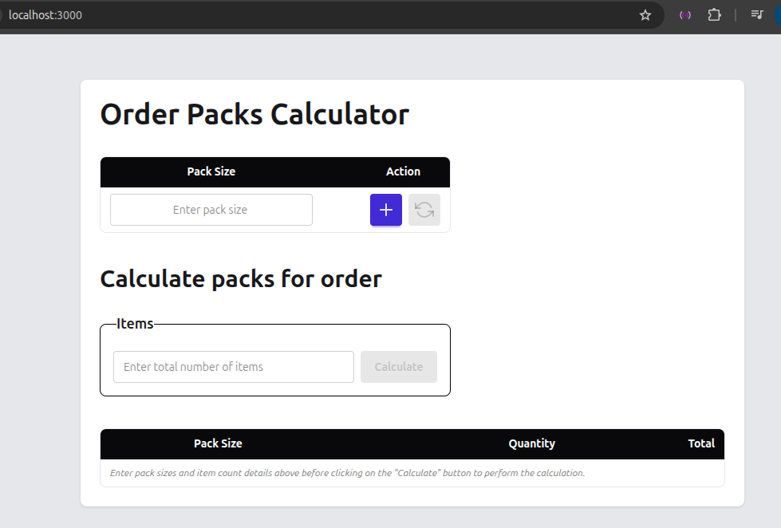
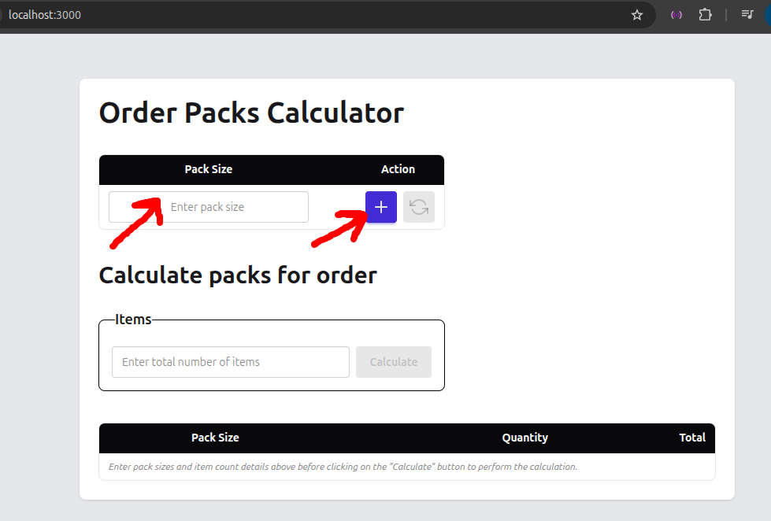
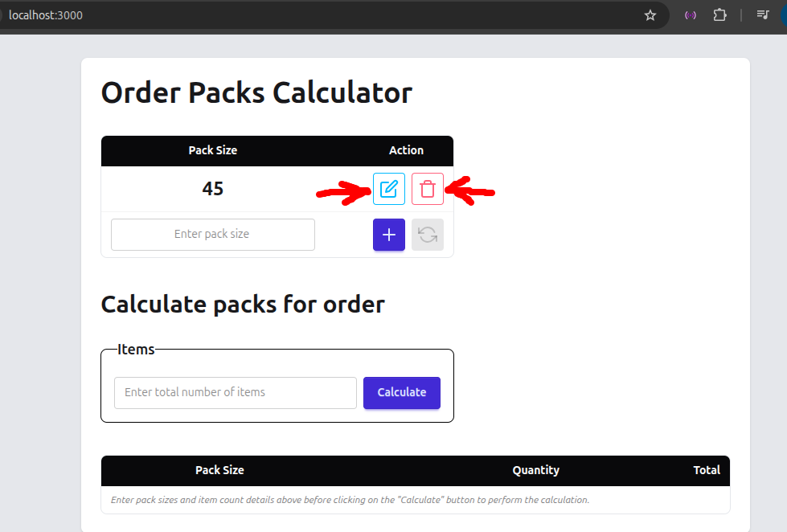
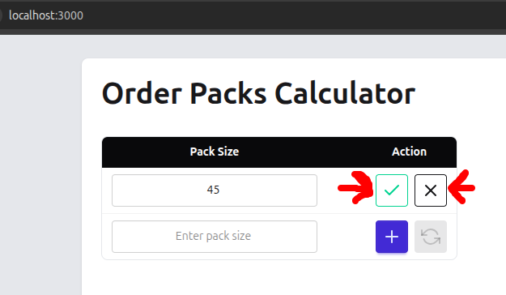
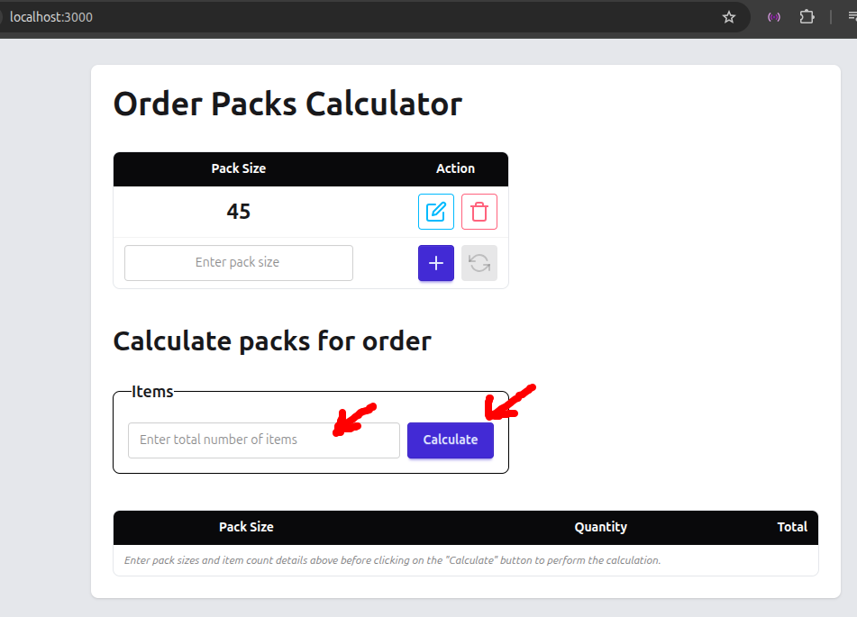
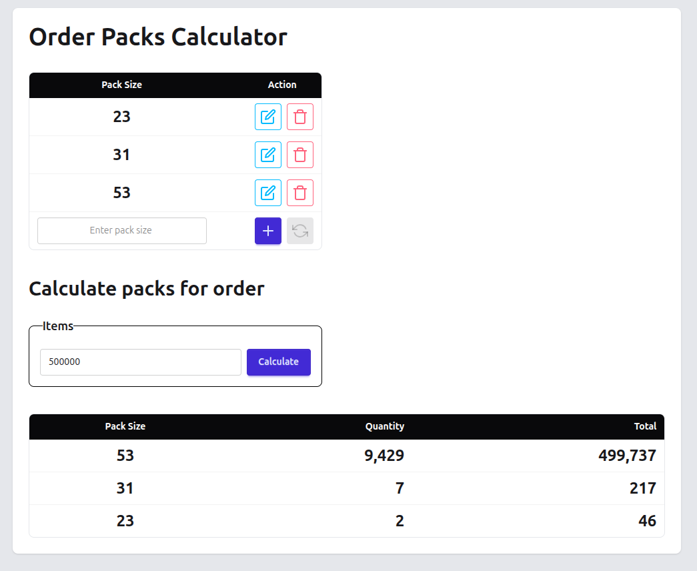

# Order Packs Calculator

Order Packs Calculator is a tool that calculates the optimum combination of different pack sizes for shipping a given number of items.

- Supports docker compose with hot reloading during development using [Air](https://github.com/air-verse/air)
- Entire application, both frontend & backend builds as a single binary
- Project architecture/structure based on simplified Hexagonal Architecture
- Can be developed locally without installing Golang (Docker required)

## Getting started

The application was been setup simplify development as much as possible and a `Makefile` has been included to simplify routine actions/builds.

### Requirements
The project contains a `compose.yaml` file tha can be used for local developnmet. This means that the only requirement for being able to run the project locally is to have [Docker](https://www.docker.com/) installed.

### Starting the application
Open a terminal at the project root and enter the following command
```bash
make dev
```
This will run **docker compose** and it might take several minuetes for the container to be pulled & built locally.

Once the application is running, the UI can be accessed by opening `http://localhost:3000`

<p align="center">

</p>

## Testing
The application can be tested by running unit tests and also manually testing via the UI.

### Unit tests
Enter the following command in a terminal at the root of the project to run all unit tests:

```bash
make test
```

### Manual testing via UI
Start the application as described in "Starting the application" section and enter the following address in your browser:

`http://localhost:3000`

Next, enter a package capacity in the input titled: *Enter pack size* and click on the plus (+) button to add the pack size. Repeat for any number of pack sizes as required.

<p align="center">

</p>

When at least one pack size has been added, edit and delete buttons will become available for every item.

<p align="center">

</p>

After updating the package size, click on the check icon to save or the cross icon to cancel.

<p align="center">

</p>

Enter the total number of items that need to be shipped

<p align="center">

</p>

Observe that the pack size, quantity and total number of items are now displayed in a table.

<p align="center">

</p>

## Building the application
Three different build commands have meen added to the `Makefile` for cross-compilation to

### Windows
```bash
make build-windows
```

### Apple Mac (intel)
```bash
make build-mac-intel
```

### Apple Mac (Apple Silicon)
```bash
make build-mac-arm
```

### Linux
```bash
make build-linux
```

### Live app

The application has been deployed to [DigitalOcean](https://www.digitalocean.com/) and can be viewed at:

https://order-packs-calculator-app-qyrvb.ondigitalocean.app